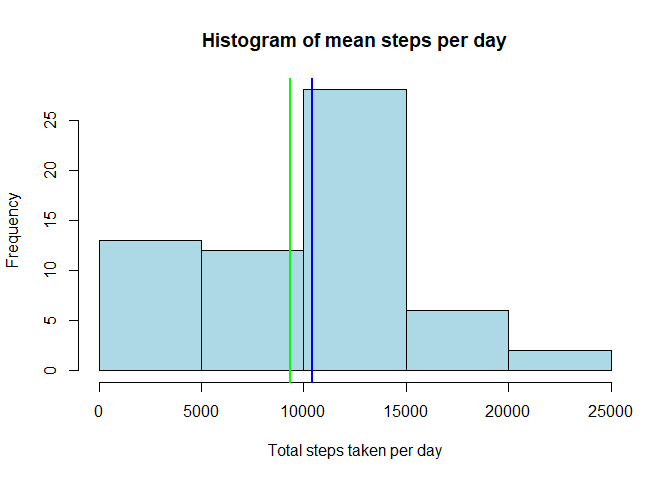
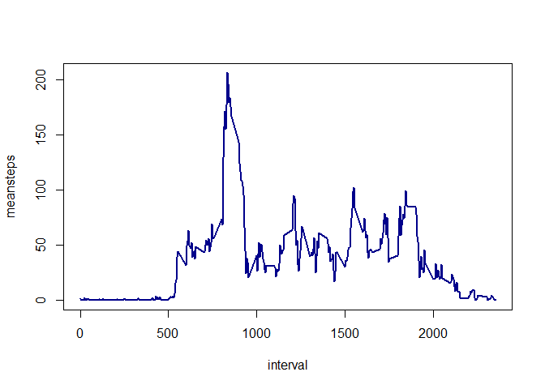
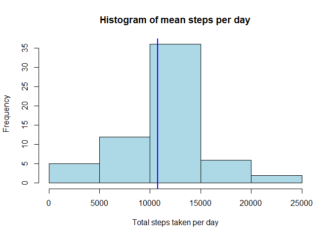
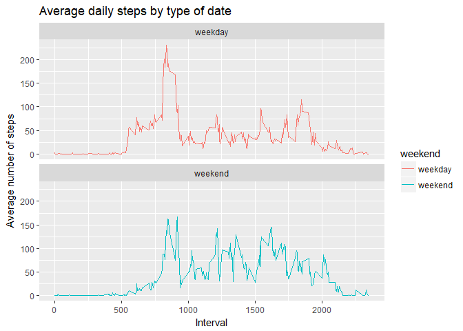

## Loading and preprocessing the data


```r
library(data.table)
activitydata<-fread("./activity/activity.csv")
head(activitydata)
```

```
##    steps       date interval
## 1:    NA 2012-10-01        0
## 2:    NA 2012-10-01        5
## 3:    NA 2012-10-01       10
## 4:    NA 2012-10-01       15
## 5:    NA 2012-10-01       20
## 6:    NA 2012-10-01       25
```

```r
tail(activitydata)
```

```
##    steps       date interval
## 1:    NA 2012-11-30     2330
## 2:    NA 2012-11-30     2335
## 3:    NA 2012-11-30     2340
## 4:    NA 2012-11-30     2345
## 5:    NA 2012-11-30     2350
## 6:    NA 2012-11-30     2355
```

```r
summary(activitydata)
```

```
##      steps            date              interval     
##  Min.   :  0.00   Length:17568       Min.   :   0.0  
##  1st Qu.:  0.00   Class :character   1st Qu.: 588.8  
##  Median :  0.00   Mode  :character   Median :1177.5  
##  Mean   : 37.38                      Mean   :1177.5  
##  3rd Qu.: 12.00                      3rd Qu.:1766.2  
##  Max.   :806.00                      Max.   :2355.0  
##  NA's   :2304
```

```r
names(activitydata)
```

```
## [1] "steps"    "date"     "interval"
```

```r
#Date is a character and should be converted to date
#lubridate function can be used for it

library(lubridate)
```

```
## 
## Attaching package: 'lubridate'
```

```
## The following objects are masked from 'package:data.table':
## 
##     hour, isoweek, mday, minute, month, quarter, second, wday,
##     week, yday, year
```

```
## The following object is masked from 'package:base':
## 
##     date
```

```r
activitydata[,date:=ymd(date)]

#add additional columns to indicate the day of the week
activitydata[,weekday:=weekdays(date)]
```


## What is mean total number of steps taken per day?

```r
meanstepsperday<-activitydata[,sum(steps,na.rm = TRUE),by=date]
names(meanstepsperday)<-c("date","meansteps")

#histogram of mean steps per day
hist(meanstepsperday$meansteps,main="Histogram of mean steps per day",xlab = "Total steps taken per day", col = "light blue")

#mean of the mean steps per day
mean(meanstepsperday$meansteps)
```

```
## [1] 9354.23
```

```r
abline(v=mean(meanstepsperday$meansteps),col="green",lwd=2)

#median of the mean steps per day
median(meanstepsperday$meansteps)
```

```
## [1] 10395
```

```r
abline(v=median(meanstepsperday$meansteps),col="blue",lwd=2)
```

<!-- -->


## What is the average daily activity pattern?
-Make a time series plot (i.e. type = "l") of the 5-minute interval (x-axis) and the average number of steps taken, averaged across all days (y-axis)


```r
dailyintervalpattern<-activitydata[,mean(steps,na.rm = TRUE),by=interval]
names(dailyintervalpattern)<-c("interval","meansteps")
with(dailyintervalpattern,plot(interval,meansteps,type="l",col="darkblue",lwd=2))
```

<!-- -->

-Which 5-minute interval, on average across all the days in the dataset, contains the maximum number of steps?


```r
dailyintervalpattern[which.max(dailyintervalpattern$meansteps), ]$interval
```

```
## [1] 835
```


## Imputing missing values

There are a number of days/intervals where there are missing values
(coded as NA). The presence of missing days may introduce bias into some
calculations or summaries of the data.

1. Calculate and report the total number of missing values in the dataset
(i.e. the total number of rows with NAs)


```r
sum(is.na(activitydata$steps))
```

```
## [1] 2304
```

2. Devise a strategy for filling in all of the missing values in the dataset. The
strategy does not need to be sophisticated. For example, you could use
the mean/median for that day, or the mean for that 5-minute interval, etc.

The strategy adopted will be to fill in the missing values with the average steps for that interval

3. Create a new dataset that is equal to the original dataset but with the
missing data filled in.


```r
activitydata[,imputedsteps:=dailyintervalpattern$meansteps[match(interval, dailyintervalpattern$interval)]]

newactivitydata<-activitydata
newactivitydata[,stepsfilled:=as.numeric(steps)]
newactivitydata[is.na(stepsfilled),stepsfilled:=imputedsteps]
```

-Make a histogram of the total number of steps taken each day and Calculate
and report the mean and median total number of steps taken per day. 


```r
meanstepsperdaynew<-newactivitydata[,sum(stepsfilled,na.rm = TRUE),by=date]
names(meanstepsperdaynew)<-c("date","meansteps")

#histogram of mean steps per day
hist(meanstepsperdaynew$meansteps,main="Histogram of mean steps per day",xlab = "Total steps taken per day", col = "light blue")

#mean of the mean steps per day
mean(meanstepsperdaynew$meansteps)
```

```
## [1] 10766.19
```

```r
abline(v=mean(meanstepsperdaynew$meansteps),col="green",lwd=2)

#median of the mean steps per day
median(meanstepsperdaynew$meansteps)
```

```
## [1] 10766.19
```

```r
abline(v=median(meanstepsperdaynew$meansteps),col="blue",lwd=2)
```

<!-- -->

-Do these values differ from the estimates from the first part of the assignment?
Yes. The values are different

-What is the impact of imputing missing data on the estimates of the total
daily number of steps?
We see the mean and median settle down close to each other and smoothening of the data by reducing the variances associated with NA intervals

## Are there differences in activity patterns between weekdays and weekends?

-Create a new factor variable in the dataset with two levels - "weekday"
and "weekend" indicating whether a given date is a weekday or weekend
day.


```r
head(newactivitydata)
```

```
##    steps       date interval weekday imputedsteps stepsfilled
## 1:    NA 2012-10-01        0  Monday    1.7169811   1.7169811
## 2:    NA 2012-10-01        5  Monday    0.3396226   0.3396226
## 3:    NA 2012-10-01       10  Monday    0.1320755   0.1320755
## 4:    NA 2012-10-01       15  Monday    0.1509434   0.1509434
## 5:    NA 2012-10-01       20  Monday    0.0754717   0.0754717
## 6:    NA 2012-10-01       25  Monday    2.0943396   2.0943396
```

```r
newactivitydata[,weekend:=ifelse(weekday %in% c("Saturday","Sunday"),"weekend","weekday")]
```


-Make a panel plot containing a time series plot (i.e. type = "l") of the
5-minute interval (x-axis) and the average number of steps taken, averaged
across all weekday days or weekend days (y-axis).


```r
library(ggplot2)

newactivitydata_summary<-newactivitydata[,mean(stepsfilled),by=.(interval,weekend)]
names(newactivitydata_summary)<-c("interval","weekend","meansteps")
head(newactivitydata_summary)
```

```
##    interval weekend  meansteps
## 1:        0 weekday 2.25115304
## 2:        5 weekday 0.44528302
## 3:       10 weekday 0.17316562
## 4:       15 weekday 0.19790356
## 5:       20 weekday 0.09895178
## 6:       25 weekday 1.59035639
```

```r
#activity_by_date <- aggregate(steps~interval + datetype, activity, mean, na.rm = TRUE)
finalplot<- ggplot(newactivitydata_summary, aes(x = interval , y = meansteps, color = weekend)) + geom_line() +labs(title = "Average daily steps by type of date", x = "Interval", y = "Average number of steps") +facet_wrap(~weekend, ncol = 1, nrow=2)
print(finalplot)
```

<!-- -->
